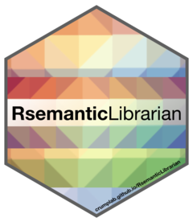

# Semantic Librarian



Build a searchable vector-space library from your own documents: journal abstracts, a
Zotero export, a folder of notes, a novel. Words, documents, and grouping variables such
as authors or years are all placed in one semantic space, so you can search by meaning
rather than keywords and ask which authors, years, or documents sit near each other.

The method comes from **Aujla, Crump, Cook & Jamieson (2019). The Semantic Librarian: A
search engine built from vector-space models of semantics. _Behavior Research Methods_.
<https://doi.org/10.3758/s13428-019-01268-4>**. Word meanings are learned with BEAGLE
(Jones & Mewhort, 2007), a model of human semantic memory; documents are sums of their
words, and authors are sums of their documents.

> **Status:** this repository is being rebuilt as a general Python tool. The plan is in
> [`plan.md`](plan.md). The original R package is preserved, unchanged, in
> [`legacy/R`](legacy/R).

## Documentation

The documentation is in `docs/`: four tutorials (a library of abstracts, a BibTeX
file, any text with your own factors, and a public-domain library of 9,932 NSF-funded
projects with investigators, institutions and funding programs as factors), a guide to inputs, PDFs and the web app, command
and Python references, and notes for users of the R package. To read it as a website:

```bash
pip install -e ".[docs]"
mkdocs serve
```

The tutorials are also runnable scripts in `examples/`.

## Something to try

The repository includes a prepared, public-domain data set: 9,932 research projects
funded by the U.S. National Science Foundation in fiscal year 2024, with their
investigators, institutions, states and funding programs.

```bash
python examples/nsf_awards.py      # builds libraries/nsf, about 3 minutes
sl serve libraries/nsf --open
```

## Install

Requires Python 3.11 or newer.

```bash
pip install "git+https://github.com/CrumpLab/RsemanticLibrarian"
# with PDF support (adds pymupdf)
pip install "semantic-librarian[pdf] @ git+https://github.com/CrumpLab/RsemanticLibrarian"
# or, from a checkout
pip install -e ".[dev]"
```

## Quick start

```bash
sl init mylib                                   # create a library directory
sl add mylib references.bib                     # BibTeX / BibLaTeX (e.g. a Zotero export)
sl add mylib articles.csv --text title,abstract --factor author=authors:; --id doi
sl add mylib notes/*.md --split paragraph       # plain text or Markdown
sl add mylib ~/papers                           # a folder of PDFs (searched at any depth)
sl build mylib                                  # learn BEAGLE vectors and build all spaces
sl search mylib "attention and memory in skilled typing"
sl search mylib "perception attention memory" --mode or --years 1990-2010
sl search mylib "typing" --space word           # nearest words
sl search mylib "response conflict" --space chunk   # best passages of the PDFs, with pages
sl search mylib "keyboard typing" --method hybrid   # meaning + keywords (BM25), fused
sl similar mylib "Crump, Matthew J. C." --space author            # similar authors
sl similar mylib "Crump, Matthew J. C." --space author --target document
sl serve mylib --open                           # search it in your web browser
sl export mylib site/                           # the same web app as a folder for any web host
sl info mylib
sl evaluate mylib                               # compare methods with the paper's simulations
```

The same operations are available from Python:

```python
from semantic_librarian import Library

lib = Library.create("mylib")
lib.add_file("references.bib")
lib.build()  # embedder="beagle" by default

result = lib.search("perception attention memory", mode="or", k=20)
for hit in result.hits:
    print(hit.rank, round(hit.score, 3), hit.document.title())

lib.similar("Crump, Matthew J. C.", space="author", k=10)
lib.project([h.label for h in result.hits], n_clusters=3)  # 2-D MDS map + k-means
```

## In the browser

`sl serve mylib --open` opens the library in a web browser on your own computer.
`sl export mylib site/` writes the same thing as a folder of plain files that any static
web host (GitHub Pages, Netlify, a university web space) can serve; there is no
server-side code, because the browser loads the vectors and does the search itself.

- **Search by text** ranks documents, words, authors or any other factor against what
  you type, with the three query styles of the original interface (the words together,
  every word, any word) and a year range.
- **Find similar** starts from an item of the library and ranks any kind of item
  against it: documents near a document, authors near an author, authors near a
  document, and so on.
- The results are drawn as a map (multidimensional scaling with k-means groups, as in
  the original Shiny app), and selecting one shows its abstract and details.

Vectors are exported as 8-bit integers, a quarter of their size on disk, which changes
similarities by less than 0.01 (`--precision float32` exports them exactly). The full
APA library exports to 144 MB; the browser downloads the document and word vectors
(73 MB) on the first search. Keyword and hybrid search are not available in the
browser yet.

## Inputs

| Format | Extensions | What becomes a document | Factors |
|---|---|---|---|
| BibTeX | `.bib` | each entry; title, abstract and keywords are embedded | author, year, venue |
| JSON / JSON Lines | `.json`, `.jsonl` | each object | `author`/`authors`/`authorlist` and `year` automatically, or `--factor` |
| CSV / TSV | `.csv`, `.tsv` | each row | as for JSON |
| Text / Markdown | `.txt`, `.md` | the file, each paragraph, or each sentence (`--split`) | source file |
| PDF | `.pdf` | the whole file, and each chunk of about 200 words (`--chunk-words`) | author, from the PDF metadata |

### PDFs

A PDF is read in full (needs the `pdf` extra). Running headers, footers and page numbers
are removed, words hyphenated across lines are rejoined, and the text is cut into
chunks of a few paragraphs that remember their pages. The PDF is one document whose
vector is the sum of its chunk vectors, so it appears in ordinary searches next to
BibTeX or CSV records. Its chunks form a `chunk` space of their own:
`sl search mylib "..." --space chunk` returns passages with page numbers, and
`sl similar mylib "paper#3" --space chunk --target document` finds documents close to
one passage.

The title comes from the PDF metadata when it looks like a title, otherwise from the
largest text on the first page, otherwise from the file name. PDF metadata rarely holds
a reliable year, so none is assigned. Scanned PDFs without a text layer are reported
and skipped (no OCR). Keyword and hybrid search rank whole documents, not chunks.

Any field can be a **factor**: every factor gets its own vector space, where each level
(an author, a year, a chapter) is the sum of the vectors of the documents carrying it.

## Embedders

| Name | Model |
|---|---|
| `beagle` (default) | BEAGLE with context and order information, as described in the paper |
| `beagle-legacy` | context-only BEAGLE, numerically identical to the R package |
| `beagle-rp` | BEAGLE with random permutations (Sahlgren et al., 2008) |
| `random` | the paper's non-semantic control: random vectors per word |

Change the embedder or its parameters with `sl build mylib --embedder beagle-rp` or
`--param max_ngram=5`, or edit `mylib/config.toml`. BEAGLE's order information is
computed on several processor cores for large corpora (`--param workers=N`; the result
does not depend on N). Transformer-based embedders are deferred for now.

## Search methods

`--method` chooses how documents are ranked:

* **semantic** (default): cosine similarity in the vector space.
* **lexical**: BM25 keyword scoring over the same tokens.
* **hybrid**: reciprocal rank fusion of the two; `--lexical-weight` sets the keyword
  share (default 0.5). Useful when exact terms matter as much as meaning.

For semantic search, `--mode` chooses how the query's words combine:

* **compound**: the query's word vectors are summed (paper Eq. 9).
* **and**: documents must be close to every query word (product of cosines).
* **or**: documents close to any one query word rank highly.

Stop words are hidden when ranking the word space (`--stopwords` shows them).

## Evaluating methods on your corpus

`sl evaluate mylib` runs the paper's three simulations on your own documents:
(1) find a document from a random sample of 5-100% of its words, (2) the same with each
word replaced by its nearest semantic neighbor, and (3) the rank agreement between
methods. It compares any embedders with the paper's word-match control, BM25, and the
hybrid ranking, and prints median ranks, top-10 rates and Spearman correlations
(`--out results.json` keeps every query).

```bash
sl evaluate mylib --methods beagle,beagle-rp,random,wordmatch,bm25,hybrid -n 200
sl evaluate mylib --methods beagle,beagle-legacy --param beagle.max_ngram=3
sl evaluate mylib --simulations 2 --associates outside-document   # stricter simulation 2
```

Results on the paper's full corpus of 27,560 APA articles are in
[docs/apa-evaluation.md](docs/apa-evaluation.md).

## What is in a library

```
mylib/
├── config.toml       text mode, fields, factors, embedder and parameters
├── library.sqlite    documents, factors, sources, build history, keyword index
└── vectors/          one .npy matrix + labels per space, vocabulary, build record
```

## Development

```bash
uv venv && uv pip install -e ".[dev]"
pytest                   # unit tests, including numerical parity with the R package
ruff check . && mypy
```

`scripts/legacy_reference.R` regenerates the R reference outputs used by the parity
tests; `scripts/convert_legacy_fixtures.py` converts the R package's sample data.

## About

The Semantic Librarian is a collaboration between [Matthew Crump](https://crumplab.github.io)
(Brooklyn College of CUNY), [Harinder Aujla](http://ion.uwinnipeg.ca/%7Ehaujla/) (University
of Winnipeg) and [Randall Jamieson](https://umcognitivesciencelaboratory.weebly.com)
(University of Manitoba). Open science project: <https://osf.io/wfcmg/>.

Licensed under the GNU GPL, version 2 or later.
